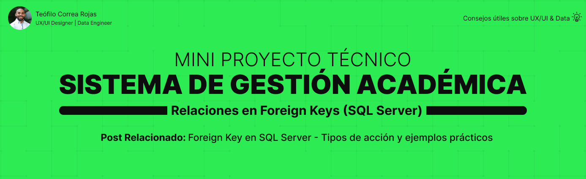

# 🎓 Sistema de Gestión Académica – Relaciones en Foreign Keys (SQL Server)

Este mini proyecto representa una estructura académica simplificada con el objetivo de **practicar las distintas acciones de integridad referencial en claves foráneas (Foreign Key)** usando SQL Server.

Forma parte de una serie de proyectos prácticos educativos alineados con publicaciones técnicas en LinkedIn.  
El enfoque de este módulo es **entender, aplicar y probar las relaciones entre tablas y sus comportamientos ON DELETE / ON UPDATE** en distintos escenarios.

## 📚 Contenido

- 🎯 [Caso de Negocio](docs/caso_negocio.md)
- 📂 [Diagrama Conceptual](docs/diagrama_conceptual.md)
- 📊 [Diagrama Lógico](docs/diagrama_logico.md)
- 🔗 [Relaciones entre Tablas](docs/relaciones_entre_tablas.md)
- ⚙️ [Diagrama Físico](docs/diagrama_fisico.md)
- 🛡️ [Estrategia de Seguridad](docs/estrategia_seguridad_masking.md)
- 🗄️ [Scripts SQL](/scripts_sqlserver)

## 👨‍💻 Autor
[Teófilo Correa Rojas](https://www.linkedin.com/in/te%C3%B3filo-correa-rojas/)
