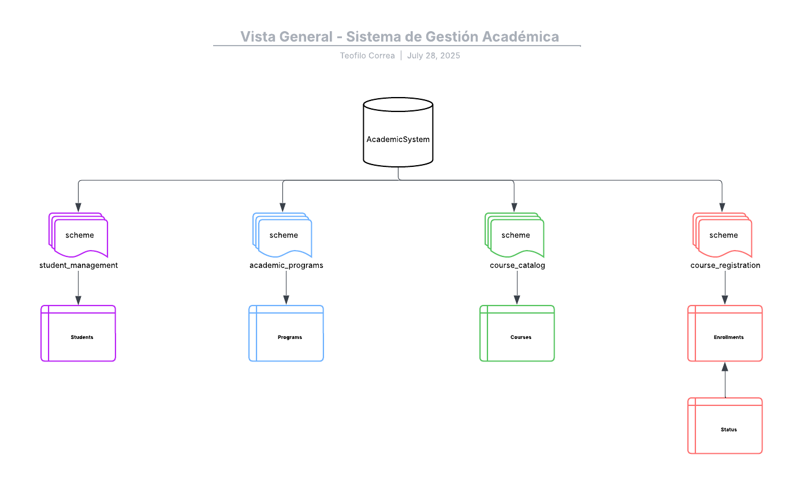

# 🗂️ Diagrama Conceptual – Sistema de Gestión Académica

## 🧩 Descripción General

Este diagrama conceptual representa la estructura inicial del sistema de base de datos **AcademicSystem**, enfocado en el manejo de estudiantes, programas académicos, cursos y registros de matrícula.

El propósito principal de este modelo es establecer una base clara sobre la cual se construirán las relaciones referenciales con distintos comportamientos (`ON DELETE`, `ON UPDATE`) utilizando SQL Server.

## 🏗️ Esquemas definidos

| Esquema               | Propósito                                 |
|-----------------------|-------------------------------------------|
| `student_management`  | Gestión y registro de los estudiantes     |
| `academic_programs`   | Administración de programas académicos    |
| `course_catalog`      | Organización y detalle de los cursos      |
| `course_registration` | Registro de inscripciones de estudiantes  |

## 🧱 Entidades principales

| Esquema               | Entidad       | Descripción breve                           |
|-----------------------|---------------|---------------------------------------------|
| `student_management`  | `Students`    | Almacena datos de los alumnos               |
| `academic_programs`   | `Programs`    | Define carreras o diplomados disponibles    |
| `course_catalog`      | `Courses`     | Detalla asignaturas vinculadas a programas  |
| `course_registration` | `Enrollments` | Relación entre estudiantes y cursos         |

## 🔗 Relaciones previstas

Aunque no se incluyen aún las relaciones formales (estas se aplicarán en fases lógicas y físicas), se anticipan relaciones 1:N como:

- Un `Program` puede tener muchos `Courses`.
- Un `Student` puede tener muchas `Enrollments`.
- Un `Course` puede tener muchas `Enrollments`.

## 🎯 Nota sobre evolución del modelo

> Este modelo conceptual está sujeto a ajustes durante la etapa de diseño físico.  
> Es posible que surjan tablas complementarias o estructuras auxiliares a medida que se incorporen las reglas de normalización, claves foráneas y necesidades de seguridad de datos.

---

🧠 Autor: **Teófilo Correa Rojas**  
📅 Fecha: `25 de julio, 2025`  
📌 Proyecto: *Sistema de Gestión Académica – Acciones en FK*