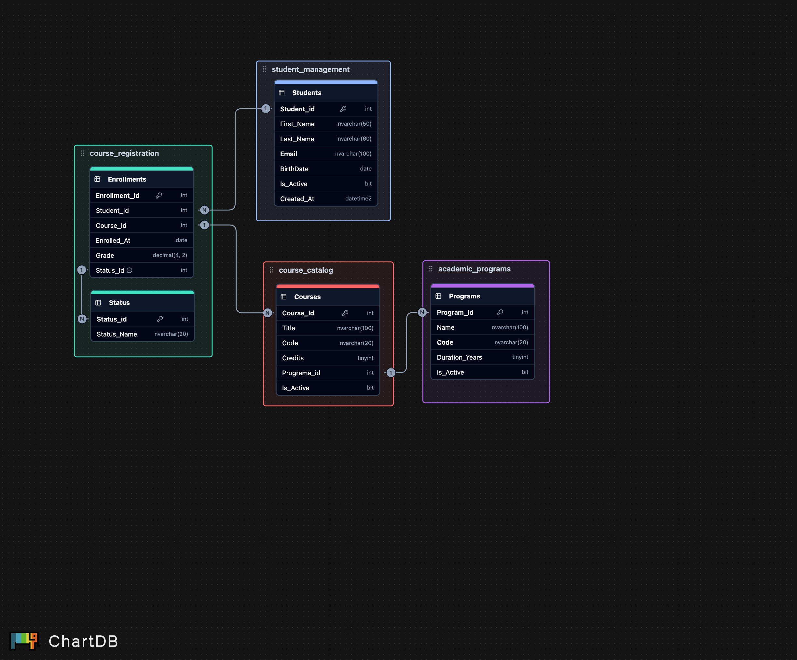

# 🧠 Diagrama Lógico – Sistema de Gestión Académica

Este modelo lógico representa las estructuras internas de las tablas principales del sistema **AcademicSystem**, con sus columnas y tipos de datos definidos en función del dominio.

Aún no se han definido claves foráneas ni constraints relacionales, ya que esta etapa se enfoca en entender la estructura y preparación para normalización.

---

## 🧾 Esquema: `student_management`

### Tabla: `Students`

| Columna    | Tipo de dato  | Descripción                             |
|------------|---------------|-----------------------------------------|
| Student_Id | INT (PK)      | Identificador único del estudiante      |
| First_Name | NVARCHAR(50)  | Primer nombre                           |
| Last_Name  | NVARCHAR(60)  | Apellido                        |
| Email      | NVARCHAR(100) | Correo institucional o personal         |
| BirthDate  | DATE          | Fecha de nacimiento                     |
| Is_Active  | BIT           | Estatus del estudiante (activo/inactivo) |
| Created_At | DATETIME2     | Fecha de registro                       |

---

## 🧾 Esquema: `academic_programs`

### Tabla: `Programs`

| Columna        | Tipo de dato     | Descripción                            |
|----------------|------------------|----------------------------------------|
| Program_Id     | INT (PK)         | Identificador del programa             |
| Name           | NVARCHAR(100)    | Nombre del programa o carrera          |
| Code           | NVARCHAR(20)     | Código único del programa              |
| Duration_Years | TINYINT          | Duración del programa en años          |
| Is_Active      | BIT              | Estado actual del programa             |

---

## 🧾 Esquema: `course_catalog`

### Tabla: `Courses`

| Columna    | Tipo de dato     | Descripción                                 |
|------------|------------------|---------------------------------------------|
| Course_Id  | INT (PK)         | Identificador único de la materia           |
| Title      | NVARCHAR(100)    | Nombre o título del curso                   |
| Code       | NVARCHAR(20)     | Código corto para control académico         |
| Credits    | TINYINT          | Valor de créditos del curso                 |
| Program_Id | INT              | Programa al que pertenece (posible FK)      |
| Is_Active  | BIT              | Si el curso está disponible actualmente     |

---

## 🧾 Esquema: `course_registration`

### Tabla: `Enrollments`

| Columna       | Tipo de dato     | Descripción                                                                                 |
|---------------|------------------|---------------------------------------------------------------------------------------------|
| Enrollment_Id | INT (PK)         | ID del registro de matrícula                                                                |
| Student_Id    | INT              | Estudiante inscrito (posible FK)                                                            |
| Course_Id     | INT              | Curso inscrito (posible FK)                                                                 |
| Enrolled_At   | DATE             | Fecha de inscripción                                                                        |
| Grade         | DECIMAL(4,2)     | Nota final del curso (si aplica)                                                            |
| Status        | NVARCHAR(20)     | Estado: Inscrito, Retirado, Aprobado, etc. Se puede crear una tabla para manejar ese status |

---

## ⚠️ Observaciones para validación

- `status` en `Enrollments` puede convertirse en una **tabla secundaria** (`EnrollmentStatus`) si se desea normalizar.
- `is_active` puede estandarizarse para control centralizado (ej. `Statuses`)
- `email` puede requerir una estrategia de seguridad como **enmascaramiento (DDM)**

### ✔️ Esta tabla cumple con la Primera Forma Normal (1FN) ya que:
- Cada atributo almacena un único valor por celda.
- No existen listas ni concatenaciones de datos dentro de los campos.
- Cada columna representa una propiedad indivisible del estudiante.